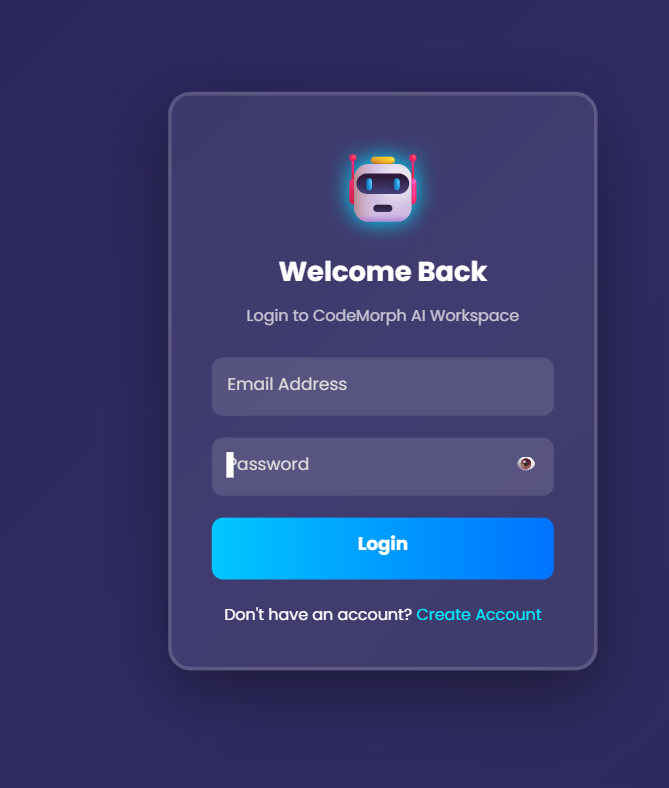
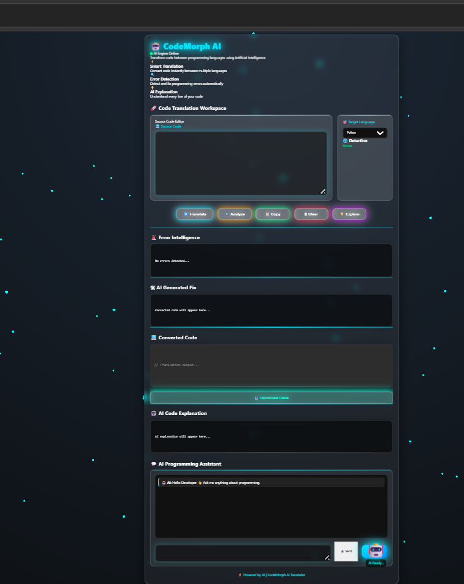

# 🚀 AI Code Translator

<p align="center">
  
</p>

<h3 align="center">
AI-powered multi-language code translation platform
</h3>

<p align="center">
Convert, analyze, explain, and understand code using Artificial Intelligence.
</p>

---

## 🌟 About Project

**AI Code Translator** is an AI-powered platform that converts source code from one programming language to another.

The platform helps developers, students, and beginners to:

- Learn different programming languages
- Migrate code between technologies
- Understand complex programming logic
- Analyze and improve source code

---

# ✨ Features

## 🔄 AI Code Translation

- Convert code between multiple programming languages.
- Supported languages:

  - Python
  - Java
  - JavaScript
  - C
  - C++

---

## 🤖 AI Code Explanation

- Explains programming logic in simple language.
- Helps beginners understand complex code.
- Provides step-by-step explanation.

---

## 🔍 Intelligent Code Analysis

- Detects possible programming errors.
- Suggests improvements.
- Provides AI-based code recommendations.

---

## 🔐 Authentication System

- User Registration
- User Login
- Secure password encryption using bcrypt
- JWT-based authentication
- User session management

---

## 💻 Modern User Interface

- Responsive dashboard design
- Dark mode interface
- Syntax highlighted code editor
- Copy code functionality
- Easy-to-use interface

---

## 🧠 AI Coding Assistant

- Chat-based AI support
- Programming problem solving
- Coding guidance and suggestions

---

# 📸 Screenshots

## 🏠 Home Page


## 🔐 Login Page




## 🤖 AI Translator Dashboard




## 🔄 Translation Result


---

# 🛠️ Tech Stack

## Frontend

- HTML5
- CSS3
- JavaScript
- Prism.js

## Backend

- Node.js
- Express.js

## Database

- MongoDB Atlas
- Mongoose

## Artificial Intelligence

- Ollama
- Qwen 2.5 Coder Model

## Security

- JWT Authentication
- bcrypt.js

---

# 📂 Project Structure

```
AI-Code-Translator
│
├── models
│   ├── User.js
│   └── Translation.js
│
├── screenshots
│
├── index.html
├── login.html
├── register.html
├── script.js
├── style.css
├── server.js
├── package.json
├── package-lock.json
├── .gitignore
└── README.md
```

---

# ⚙️ Installation & Setup

## 1. Clone Repository

```bash
git clone https://github.com/Bhagyashree462/AI-Code-Translator.git
```

---

## 2. Navigate to Project Folder

```bash
cd AI-Code-Translator
```

---

## 3. Install Dependencies

```bash
npm install
```

---

## 4. Environment Variables

Create a `.env` file:

```
MONGO_URI=your_mongodb_connection_string
JWT_SECRET=your_secret_key
```

---

## 5. Start Backend Server

```bash
node server.js
```

Server will start:

```
http://localhost:5000
```

---

# 🔗 API Features

| API | Description |
|---|---|
| `/register` | Create new user |
| `/login` | User authentication |
| `/translate` | Translate code |
| `/explain` | Explain code |
| `/analyze` | Analyze code |
| `/history` | View translation history |
| `/chat` | AI assistant |

---

# 🚀 Future Enhancements

- 🌐 Deploy on cloud platform
- 📝 Online code editor
- 🐞 Automatic debugging
- 📱 Mobile application
- 🔊 Voice-based coding assistant
- 📦 Download translated code files
- 🌍 Support more programming languages
- ⚡ Real-time AI coding suggestions

---

# 🎥 Demo

Demo video/GIF will be added soon.

```
Add demo.gif inside screenshots folder
```

Example:

```markdown

```

---

# 👩‍💻 Developer

**Bhagyashree Basavaraj Kalavant**

Computer Science Engineering Student

GitHub:

https://github.com/Bhagyashree462

---

# ⭐ Support

If you like this project, consider giving it a ⭐ on GitHub.

---

<p align="center">
Made with ❤️ using AI and Full Stack Technologies
</p>